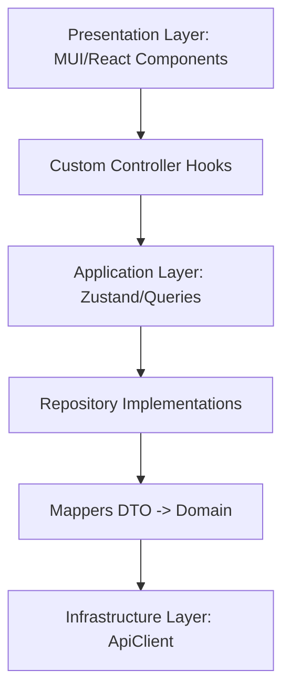

# BigTVCMS Enterprise Frontend Architecture Documentation

## Project Overview
BigTVCMS is an enterprise-grade News Content Management System (CMS) frontend designed for modern, high-traffic digital news ecosystems. It integrates with an external ASP.NET Core REST API.

---

## Architecture Goals
- **Strict Maintainability**: Clear separation of concern layers to enable team scalability.
- **Robust Type-Safety**: 100% TypeScript strict-mode compliance to eradicate run-time domain mismatches.
- **Architectural Determinism**: Code patterns are rigid and highly structured.
- **Zero Framework Lock-in**: Decoupling React UI logic from core business logic via repository interfaces and infrastructure mappers.

---

## Architecture Principles
1. **SOLID Principles**: Single responsibility classes, open-closed extensions, Liskov substitution models, interface segregation, and dependency inversion.
2. **Separation of Concerns (SoC)**: Business logic, persistence layers, UI styling, and orchestration stores do not bleed into each other.
3. **Composition over Inheritance**: React components use functional composition, slots, and React hook chains instead of heavy base component extensions.
4. **Vertical Slice / Feature First Architecture**: Features are organized around self-contained capabilities (e.g., Auth, News, Media) rather than technical layer grouping.

---

## Folder Structure & Layers

```
src/
├── app/                  # Next.js App Router Pages and Bootstrap Root Config
├── core/                 # Core Layer (Global System Orchestrations)
│   ├── api/              # Low-level ApiClient, Interceptors, and Axios Wrappers
│   ├── security/         # Route Guards, Token storage strategy, Permission policies
│   └── errors/           # Global Error Translation and Boundaries
├── shared/               # Shared Layer (Cross-Cutting UI & Utilities)
│   ├── components/       # Atomic design component library (Button, DataGrid, Modals)
│   ├── hooks/            # Pagination, sorting, filter helpers
│   └── theme/            # Theme tokens (MUI dark/light mode configurations)
└── modules/              # Feature Modules (Vertical Slice Architecture)
```

### Layer Responsibilities



1. **Presentation Layer**: Functional React components utilizing MUI. Responsible solely for mapping visual states and triggering controller hooks. No side effects.
2. **Application Layer**: Stores, hooks, queries, and orchestration services (Zustand, TanStack Query) managing asynchronous transaction state.
3. **Domain Layer**: Contains domain entities, validation schemas (Zod), and interfaces. Has zero dependencies on any external framework or infrastructure.
4. **Infrastructure Layer**: Implementation details, API calls, caching layers, Axios instances, and local storage adaptors.
5. **Shared Layer**: Reusable presentational components and utilities.
6. **Core Layer**: Global configurations, interceptors, and error abstractions.

---

## Allowed and Forbidden Dependency Flows
- **Rule 1**: Domain layer must not depend on any outer layers (Infrastructure, Presentation, Application).
- **Rule 2**: Core and Shared layers cannot import from Feature Modules (`src/modules/*`).
- **Rule 3**: Feature Modules can import from `src/core/*`, `src/shared/*`, and the local module slice.
- **Forbidden Dependency**: Cross-feature imports are prohibited. Feature A must not import directly from Feature B. Use shared contracts or global dispatch hooks instead.

---

## Design Patterns

### Repository Pattern
Hides the data-access logic (Axios/REST calls) from the application layer behind interfaces.
```typescript
// Domain Repository Contract
export interface INewsRepository {
  getArticle(id: string): Promise<NewsArticle>;
}

// Infrastructure Implementation
export class NewsRepository implements INewsRepository {
  constructor(private apiClient: ApiClient) {}
  async getArticle(id: string): Promise<NewsArticle> {
    const rawDto = await this.apiClient.get<NewsArticleDto>(`/news/${id}`);
    return NewsMapper.toDomain(rawDto);
  }
}
```

### Facade Pattern
Consolidates complex hooks and selectors into a clean API for presentation components.
```typescript
export function useNewsListFacade() {
  const { items, isLoading } = useNewsQuery();
  const { sort, handleSort } = useSorting();
  return { items, isLoading, sort, handleSort };
}
```

### Mapper & DTO Patterns
- **DTO**: Models raw network responses.
- **Mapper**: Pure functions transforming raw API responses to typed Domain objects and vice versa. Helps isolate API breaking changes.

---

## State Management Rules
- **Server State**: Managed exclusively by TanStack Query.
- **Global Client State**: Managed by Zustand.
- **Form State**: Managed via React Hook Form with Zod schemas.

---

## Localization Standards (next-intl)
- **Supported Locales**: English (`en`), Telugu (`te`), Hindi (`hi`), Malayalam (`ml`).
- **Standard Routing & Middleware**: Managed via localized routing configs (`src/i18n/routing.ts`) and path helpers (`src/i18n/navigation.ts`).
- **No Inline Strings**: All user-facing texts must utilize namespaces (e.g. `{t("common.save")}`).
- **Key Congruency**: Every language folder must maintain matching key trees. Missing translations will trigger compilation failures.
- **API Localization**: Handled via `Multilingual<T>` structures mapped automatically using `getLocalizedValue()` helpers.

---

## Security, Caching, and Error Handling
- **Route Guards**: Evaluated using Next.js Middleware and custom wrapper layout trees.
- **Permission Policy**: Evaluates permission scopes using bitwise or string arrays matching user JWT tokens.
- **Global Error Boundary**: Catch all visual runtime failures and fall back to standardized error components.

---

## Architecture Checklist

- [ ] All API communication goes through a Repository interface implementation.
- [ ] No JSX contains nested fetch operations or business mapping.
- [ ] Zod validation is used for both incoming payload parsing and form schemas.
- [ ] Circular imports between module domains are nonexistent.
